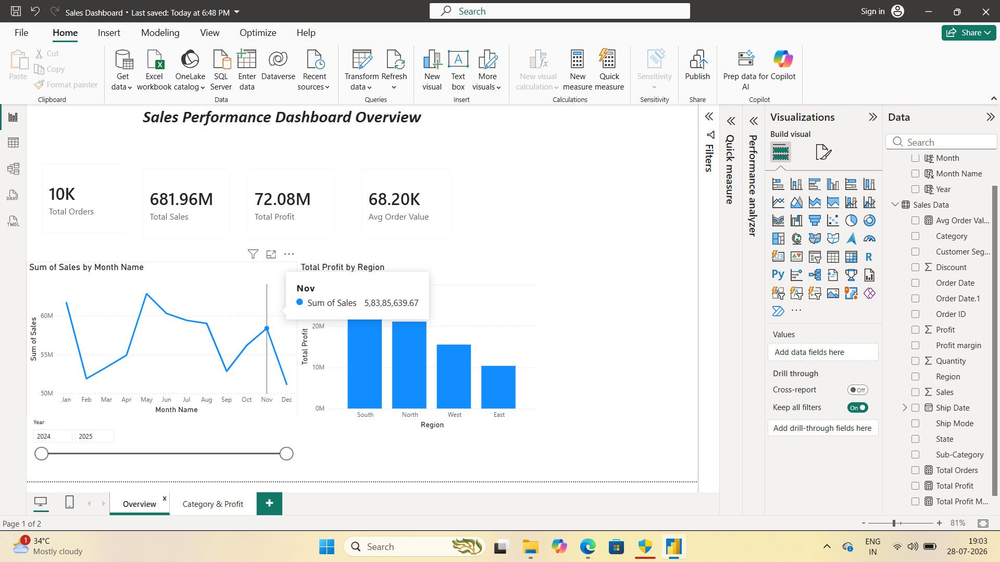

#Sales Performance Dashboard using Power BI

## Overview

This project analyzes a retail sales dataset containing **10,000 transaction records** and presents interactive business insights through a Power BI dashboard.

---

## Problem Statement

Organizations generate thousands of sales transactions daily. This project transforms raw sales data into an interactive dashboard to help stakeholders monitor sales, profit, regional performance, and product trends.

---

## Dataset

- Records: 10,000
- Columns: 13

### Features
- Order ID
- Order Date
- Ship Date
- Ship Mode
- Customer Segment
- Region
- State
- Category
- Sub-Category
- Quantity
- Discount
- Sales
- Profit

---

## Tools & Technologies

- Power BI
- Power Query
- DAX
- Microsoft Excel

---

## Dashboard Features

- Total Sales
- Total Profit
- Total Orders
- Average Order Value
- Monthly Sales Trend
- Regional Profit
- Category Analysis
- Profit Analysis
- Interactive Filters

---

## Dashboard Preview

### Overview

### Category_profit

---

## Key Insights

- Regional sales performance
- Category profitability
- Monthly sales trends
- Product performance
- Business KPIs

---

## Author

Niranjana M

Aspiring Data Analyst
